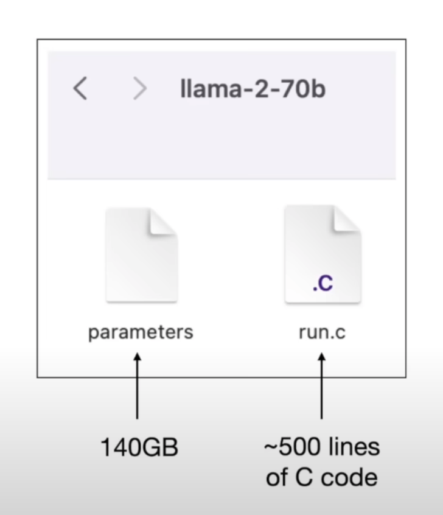
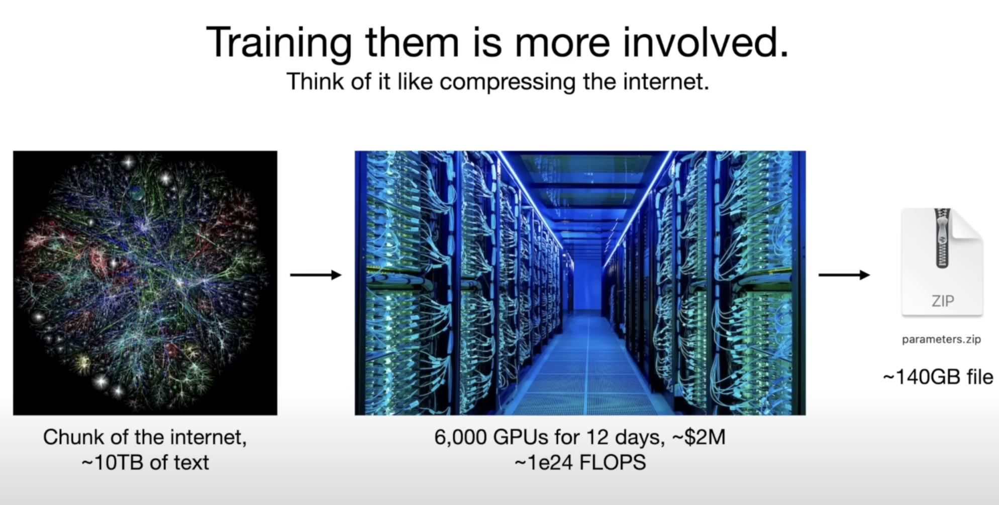
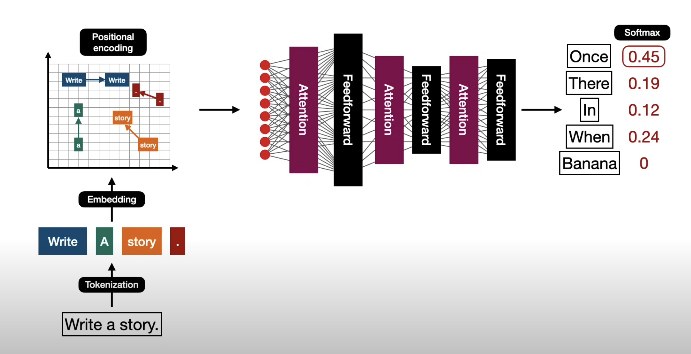

# 什么是大语言模型（LLM）

大语言模型（Large Language Model，简称LLM）是人工智能领域的一项突破性技术，专注于理解、生成和处理类似人类的自然语言。它是自然语言处理（NLP）的一个重要分支，近年来因其在翻译、对话系统、内容生成、代码编写等广泛应用中的卓越表现而备受瞩目。LLM 的核心在于通过大规模文本数据训练的复杂神经网络，使其能够捕捉语言的语法、语义和上下文关联，从而在多样化的任务中展现出强大的泛化能力。

LLM 的典型代表包括 OpenAI 的 GPT 系列（如 GPT-3、GPT-4）、Google 的 BERT、Meta AI 的 LLaMA 以及其他开源模型如 Mistral。这些模型通过海量的文本数据进行预训练，能够理解复杂的语言模式，并在特定任务上通过微调进一步优化。LLM 的发展不仅推动了人工智能的进步，还在教育、医疗、商业和娱乐等领域带来了深远的影响。

## 模型定义

从技术角度看，大语言模型是一个深度神经网络，通常包含数十亿甚至上千亿个参数。这些参数是模型在训练过程中优化的权重，用于捕捉语言的复杂模式和规律。模型的规模（参数数量）通常与其性能密切相关：参数越多，模型通常能够处理更复杂的任务，但同时也需要更多的计算资源和能耗。

LLM 的训练过程分为两个主要阶段：

1. **预训练（Pre-training）**：模型在海量的通用文本数据集（如网页、书籍、文章等）上进行训练，以学习语言的基本模式。这种训练通常需要高性能计算集群和数周甚至数月的计算时间。
2. **微调（Fine-tuning）**：在预训练的基础上，模型会针对特定任务（如问答、翻译或情感分析）使用较小规模的标注数据集进行进一步优化，以提高在特定场景下的表现。

LLM 的一个显著特点是其泛化能力。经过预训练的模型可以在多种任务中表现出色，甚至在未见过的数据上也能生成合理的输出。这种能力使其成为构建通用人工智能（AGI）的重要基石。

## 模型只是一个文件

从用户的角度来看，一个大语言模型本质上是一个包含模型权重和架构配置的文件。这个文件存储了模型在训练过程中学到的所有知识，通常以二进制格式保存，文件大小可能从几 GB 到几百 GB 不等，具体取决于模型的规模和复杂性。例如，Hugging Face 平台上提供的开源模型（如 LLaMA 或 Falcon）通常以这种文件形式分发，供开发者和研究人员下载和使用。

这些模型文件可以部署在各种计算设备上，包括：

- **云服务器**：用于大规模推理任务，支持高并发用户请求。
- **个人电脑**：通过优化技术（如量化或模型压缩），可以在高性能 GPU 或 CPU 上运行。
- **边缘设备**：在资源受限的设备（如智能手机或嵌入式系统）上运行小型或优化后的模型。

模型文件的可移植性使其在不同场景下具有高度灵活性。例如，研究人员可以在本地环境中加载模型进行实验，而企业可以将模型部署到云端为客户提供服务。

## 模型推理

模型推理（Inference）是指使用训练好的 LLM 处理输入数据并生成输出的过程。例如，当用户向一个对话模型（如 ChatGPT）输入问题时，模型会根据其内部参数分析输入，并生成相应的回答。推理是 LLM 实际应用的核心环节，广泛用于聊天机器人、语音助手、自动翻译系统等领域。

推理过程通常包括以下步骤：

1. **输入编码**：将用户输入的文本转换为模型可理解的数值表示（通常是词嵌入向量）。
2. **模型计算**：通过模型的神经网络层处理输入，生成中间表示或预测结果。
3. **输出解码**：将模型的输出（通常是概率分布）转换为人类可读的文本。

推理的性能受多种因素影响，包括：

- **硬件资源**：高性能 GPU 或 TPU 可以显著加速推理过程。
- **模型优化**：技术如量化（Quantization，降低权重精度）、修剪（Pruning，移除不重要的参数）和蒸馏（Distillation，将大型模型压缩为小型模型）可以降低计算需求，使推理在消费级硬件上可行。
- **输入复杂性**：较长的输入或复杂的任务需要更多的计算时间。

为了提高推理效率，业界还开发了专门的推理框架（如 NVIDIA 的 TensorRT 或 ONNX Runtime），以优化模型在特定硬件上的运行性能。

## 模型架构

大语言模型的架构通常基于变换器（Transformer），这是 2017 年由 Vaswani 等人提出的革命性神经网络结构。变换器通过注意力机制（Attention Mechanism）捕捉输入序列中的长距离依赖关系，使其在处理自然语言任务时表现出色。相比传统的循环神经网络（RNN），变换器具有更高的并行性和效率，成为现代 LLM 的标准架构。

一个典型的 LLM 架构包括以下核心组件：

- **嵌入层（Embedding Layer）**：将输入的词语或标记（Token）转换为高维数值向量，表示其语义信息。这些向量是模型理解语言的基础。

- 变换器块（Transformer Blocks）

  ：由多层堆叠的子模块组成，每个子模块包括：

  - **多头注意力机制（Multi-Head Attention）**：允许模型同时关注输入序列中的不同部分，捕捉复杂的语义关系。
  - **前馈神经网络（Feed-Forward Network）**：对每个输入位置的表示进行非线性变换，增强模型的表达能力。
  - **层归一化（Layer Normalization）\**和\**残差连接（Residual Connection）**：提高训练稳定性和梯度传播效率。

- **输出层（Output Layer）**：将变换器块的输出转换为最终结果，例如生成下一个词的概率分布（用于生成任务）或分类标签（用于分类任务）。

不同的 LLM 在架构上可能有所差异，例如：

- **层数**：更深的模型（更多变换器块）通常具有更强的建模能力，但计算成本也更高。
- **注意力机制类型**：如自注意力（Self-Attention）、因果注意力（Causal Attention，适用于生成任务）或稀疏注意力（Sparse Attention，降低计算复杂度）。
- **参数规模**：从几亿到上千亿不等，决定了模型的容量和性能。

一些先进的 LLM 还引入了创新的架构设计，例如：

- **混合专家模型（Mixture of Experts, MoE）**：通过动态选择子网络来降低计算成本，同时保持高性能。
- **高效变换器（Efficient Transformers）**：如 Performer 或 Linformer，通过优化注意力机制来提高计算效率。

变换器架构的灵活性和强大性使其不仅适用于语言任务，还被广泛应用于计算机视觉、多模态学习等领域。

