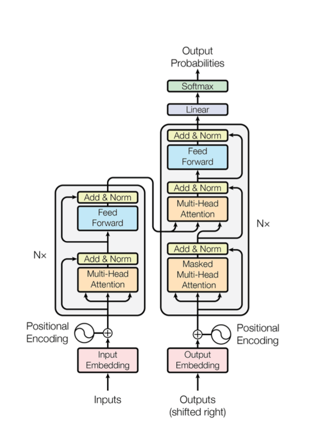
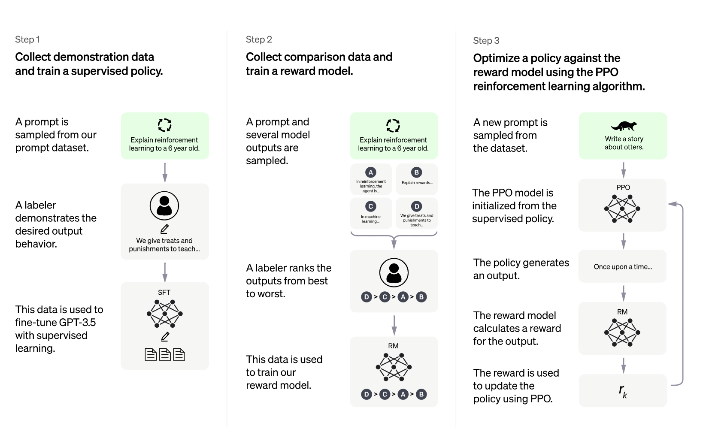
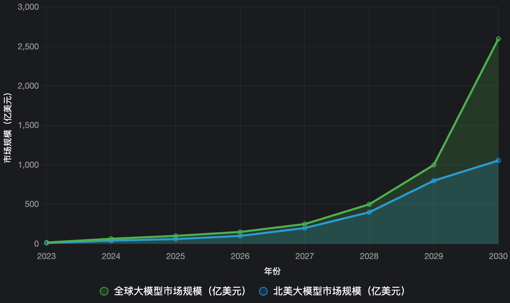

# 大模型是如何运作的

## 引言

大模型（Large Language Models，LLMs）是人工智能领域的核心技术，能够理解和生成与人类语言高度相似的文本。从聊天机器人到内容创作，再到法律和医疗评估，大模型的应用无处不在。本教程将以通俗易懂的方式，详细解析大模型的工作原理，重点阐述其输入和输出机制，并通过具体示例帮助新手理解。我们将涵盖预训练、微调、强化学习从人类反馈中学习（RLHF）、提示工程，并结合 2025 年的最新发展，提供全面的指南。

### 什么是大模型？

大模型是基于神经网络的人工智能系统，通过处理海量文本数据，学习语言的语法、语义和上下文。它们可以回答问题、生成文章，甚至编写代码。例如，OpenAI 的 ChatGPT 和 Google 的 Gemini 是典型的大模型。

### 为什么大模型重要？

大模型的出现标志着自然语言处理（NLP）的重大突破。它们不仅能处理复杂任务，还能在专业领域接近人类水平。例如：

- **日常应用**：如智能助手 Siri 或 Alexa，帮助用户安排日程。
- **商业价值**：企业用大模型优化客服、生成营销内容。
- **社会影响**：在教育、医疗等领域提供个性化支持。

## 第一部分：输入和输出的核心概念

大模型的工作本质是处理输入（input）并生成输出（output）。理解这一关系是掌握大模型运作的关键。

### 1.1 输入和输出的定义

- **输入（Input）**：用户提供的文本提示，例如问题、指令或一段文本。输入可以是简单的单词，也可以是复杂的多句描述。
- **输出（Output）**：模型根据输入生成的文本，例如回答、故事、代码或翻译。输出质量取决于输入的清晰度、模型的训练和提示设计。

### 1.2 输入如何影响输出？

大模型通过分析输入中的语言模式和上下文，生成最可能的输出。研究表明，输入的措辞、结构和具体性会显著影响输出。例如：

- **输入**：“告诉我关于巴黎的信息。”
  - **输出**：“巴黎是法国的首都，以时尚、艺术和文化闻名，拥有埃菲尔铁塔和卢浮宫等地标。”
- **输入**：“为巴黎写一份旅游指南。”
  - **输出**：“欢迎来到巴黎，光之城！从埃菲尔铁塔开始你的旅程，然后参观卢浮宫欣赏《蒙娜丽莎》。别错过巴黎圣母院，沿着塞纳河散步，享受当地小酒馆的法式美食。”
- **解释**：相同的主题（巴黎），因提示不同，输出从简短事实变为详细指南。

### 1.3 输入-输出示例

以下是一些典型场景，展示大模型如何处理输入并生成输出：

- 下一个词预测：

  - **输入**：“天空是”
  - **输出**：“蓝色”
  - **解释**：模型根据训练数据中常见的“天空是蓝色”模式预测下一个词。

- 问题解答：

  - **输入**：“《1984》的作者是谁？”
  - **输出**：“乔治·奥威尔”
  - **解释**：模型从训练数据中提取事实性信息。

- 对话：

  - **输入**：“你好，我需要帮助处理我的订单。”
  - **输出**：“您好！很高兴帮助您。请提供您的订单号。”
  - **后续输入**：“我的订单号是 12345。”
  - **输出**：“谢谢。我正在检查您的订单状态。”
  - **解释**：模型维持对话上下文，生成相关响应。

- 内容生成：

  - **输入**：“写一首关于海洋的诗。”
  - **输出**：“海洋的波浪，无尽的舞蹈，/ 拍打着海岸，节奏悠扬。/ 蓝如宝石，深邃辽阔，/ 隐藏着过去的秘密。”
  - **解释**：模型根据提示生成原创内容。

- 代码生成：

  - **输入**：“写一个 JavaScript 函数来反转字符串。”

  - 输出：

    ```javascript
    function reverseString(str) {
        return str.split('').reverse().join('');
    }
    ```

  - **解释**：模型理解编程需求并生成功能性代码。

## 第二部分：预训练（Pre-training）

预训练是大模型训练的第一步，类似于学生通过阅读大量书籍学习语言知识。在这一阶段，模型被喂入海量未标记的文本数据，学习语言的基本结构和模式。

### 2.1 Transformer 架构

Transformer 架构是大模型的核心，由 Vaswani 等人于 2017 年提出 ([Attention is All You Need](https://arxiv.org/abs/1706.03762))。其主要组件包括：

- **分词（Tokenization）**：将文本分割为词或子词单位，称为“令牌”。例如，“人工智能”可能分为“人”+“工”+“智能”。
- **嵌入（Embedding）**：将令牌转换为高维向量（如 512 维），捕捉语义信息。例如，“苹果”和“梨”在向量空间中更接近。
- **位置编码（Position Encoding）**：为每个令牌添加位置信息，解决序列顺序问题。例如，“我爱吃苹果”和“苹果吃爱我”有不同含义。
- **多头注意力（Multi-Head Attention）**：允许模型同时关注输入序列的不同部分，捕捉复杂关系。例如，在“猫坐在垫子上”，模型能关注“猫”和“垫子”。
- **前馈神经网络（Feed-Forward Neural Network）**：对每个位置的表示进行非线性变换，提取更深层特征。
- **归一化（Normalization）**：稳定训练过程，加速收敛。
- **Softmax 和线性变换**：将模型输出转换为概率分布，预测下一个令牌。

这些组件构成 Transformer 的编码器和解码器，使模型能处理长序列并捕捉远距离依赖关系。例如，GPT-3 和 BERT 均基于 Transformer。



### 2.2 数据来源

预训练数据集通常来自互联网，包括：

- **网页**：如维基百科、新闻网站。
- **书籍**：公开的电子书和文献。
- **社交媒体**：如 X 平台上的帖子 ([X Post](https://x.com/example/status/123456789)).

2020 年发表的 [GPT-3 论文](https://arxiv.org/abs/2005.14165) 提到，模型在包含数万亿词的数据集上训练。这些数据为模型提供了丰富的语言知识。

### 2.3 训练过程

预训练的目标是让模型预测下一个令牌。例如：

- **输入**：“The quick brown fox”
- **输出**：“jumped”
- **解释**：通过反复调整参数，模型学会语言模式，预测“jumped”作为下一个词。

### 2.4 输入-输出示例

- **输入**：“我爱吃”
- **输出**：“苹果”
- **解释**：模型根据训练数据中常见的搭配，预测“苹果”是可能的下一个词。

### 2.5 2025 年最新发展

- **自训练（Self-Training）**：模型生成自己的训练数据，减少人工标注需求。例如，Google 的模型通过生成问题并用精选答案微调，性能在 GSM8K 数据集上从 74.2% 提升至 82.1% ([Future of Large Language Models](https://research.aimultiple.com/future-of-large-language-models/)).
- **事实检查（Fact-Checking）**：模型通过实时访问外部数据源，验证输出真实性，减少虚假信息。
- **稀疏专家模型（Sparse Expert Models）**：仅激活模型的相关部分，提升效率。例如，OpenAI 探索稀疏模型优化资源使用。

| 技术         | 描述             | 2025 年进展                |
| ------------ | ---------------- | -------------------------- |
| 自训练       | 模型生成训练数据 | 性能提升显著，减少人工成本 |
| 事实检查     | 验证输出真实性   | 减少虚假信息，提高可靠性   |
| 稀疏专家模型 | 优化资源使用     | 提升计算效率，降低成本     |

## 第三部分：微调（Fine-tuning）

微调是将预训练模型适配特定任务或风格的过程，类似于学生针对考试复习特定科目。

### 3.1 微调的过程

- **数据准备**：雇佣人工标注者创建约 10 万个问答对话对，涵盖多样化场景。例如，“什么是量子力学？”对应一个简洁的回答。
- **训练**：使用这些对话对，通过监督学习调整模型参数，使其生成符合人类期望的响应。
- **结果**：生成一个“助手模型”，能够模仿真实对话模式，适用于特定任务。

### 3.2 输入-输出示例

- **输入**：“我的订单何时到达？”
- **输出（未微调）**：可能生成无关内容，如“请稍等。”
- **输出（微调后）**：“您的订单预计明天到达，请查看跟踪信息。”
- **解释**：微调使模型学会处理特定任务（如客服查询），生成更相关的响应。

### 3.3 应用场景

微调使模型更专业化，常见应用包括：

- **聊天机器人**：如客服助手，提供快速、准确的响应。
- **内容生成**：生成文章、广告文案或社交媒体帖子。
- **专业领域**：如法律文件起草、医疗诊断支持。

## 第四部分：强化学习从人类反馈中学习（RLHF:Reinforcement Learning from Human Feedback）

RLHF 是通过人类反馈优化模型输出的方法，使其更贴合人类偏好，类似于通过老师评分改进学生作业。

### 4.1 RLHF 的概念

- **收集反馈**：用户提供提示，模型生成多个响应，由人类根据质量排名。例如，回答“登月是什么？”的响应中，简洁易懂的排第一。
- **训练奖励模型**：使用排名数据训练一个奖励模型，评估响应质量。
- **优化模型**：通过强化学习，调整模型参数，奖励高质量响应，惩罚低质量响应。

### 4.2 输入-输出示例

- **输入**：“向六岁孩子解释登月。”
- **输出（基础模型）**：“登月是人类使用航天器到达月球的历史事件。”
- **输出（RLHF 模型）**：“人们坐大火箭去月球，留下了脚印！”
- **解释**：RLHF 使模型的回答更简洁、适合儿童理解。



### 4.3 2025 年进展

- **多维度反馈**：引入准确性、语气、相关性等评分维度，提升优化效果。
- **结合自训练**：将 RLHF 与自生成数据结合，减少人工干预。
- **伦理优化**：通过 RLHF 减少偏见和有害输出。

## 第五部分：提示工程（Prompt Engineering）

提示工程是通过设计高质量输入提示，引导模型生成期望输出的技术，无需额外训练即可优化性能，类似于给学生提供清晰的考试题目。

### 5.1 提示工程的作用

- 不同的提示可以引导模型生成不同的输出。
- 精心设计的提示可以使模型更准确地理解任务。

### 5.2 输入-输出示例

- 提示 1：“告诉我关于巴黎的信息。”
  - **输出**：“巴黎是法国的首都，以时尚、艺术和文化闻名。”
- 提示 2：“为巴黎写一份旅游指南。”
  - **输出**：“欢迎来到巴黎，光之城！从埃菲尔铁塔开始你的旅程，然后参观卢浮宫欣赏《蒙娜丽莎》。别错过巴黎圣母院，沿着塞纳河散步。”
- 提示 3：“用三句话为高中小学生解释巴黎的历史。”
  - **输出**：“巴黎始建于公元前 3 世纪，是凯尔特部落的定居点。 中世纪时，它成为法国的政治和文化中心。 今天，巴黎以其历史地标和博物馆闻名，如卢浮宫和巴黎圣母院。”
- **解释**：提示的清晰度和具体性直接影响输出的详细程度和风格。

### 5.3 更多示例

- 输入：“写一首关于海洋的诗。”

  - **输出**：“海洋的波浪，无尽的舞蹈，/ 拍打着海岸，节奏悠扬。/ 蓝如宝石，深邃辽阔，/ 隐藏着过去的秘密。”
  - **解释**：模型根据提示生成原创诗歌。

- 输入：“写一个 Python 函数来计算一个数的阶乘。”

  - 输出：

    ```python
    def factorial(n):
        if n == 0:
            return 1
        else:
            return n * factorial(n-1)
    ```

  - **解释**：模型理解编程需求并生成功能性代码。

### 5.4 提示设计技巧

- **明确指令**：如“用三句话解释”比“解释”更清晰。
- **提供示例**：展示期望的回答格式。
- **分步引导**：如“先列出步骤，再计算结果”。

### 5.5 资源

- [Prompting Guide](https://www.promptingguide.ai/introduction/basics) 提供了丰富的提示设计技术和案例，适合初学者。

### 5.6 2025 年技术

- **自动提示优化**：算法自动生成最佳提示，提高效率。
- **交互式提示设计**：用户实时调整提示，获得更精准输出。

## 第六部分：大模型的应用场景

大模型在不同领域的应用都涉及明确的输入-输出关系。以下是几个常见场景：

### 6.1 聊天机器人（Chatbots）

- **输入**：“你好，我需要帮助处理我的订单。”
- **输出**：“您好！很高兴帮助您。请提供您的订单号。”
- **后续输入**：“我的订单号是 12345。”
- **输出**：“谢谢。我正在检查您的订单状态。”
- **解释**：模型根据用户输入维护对话上下文，生成相关响应。

### 6.2 内容生成

- **输入**：“写一首关于海洋的诗。”
- **输出**：“海洋的波浪，无尽的舞蹈，/ 拍打着海岸，节奏悠扬。/ 蓝如宝石，深邃辽阔，/ 隐藏着过去的秘密。”
- **解释**：模型基于提示生成原创内容。

### 6.3 问题解答

- **输入**：“《罗密欧与朱丽叶》的作者是谁？”
- **输出**：“威廉·莎士比亚”
- **解释**：模型从训练数据中提取事实性信息并给出答案。

### 6.4 代码生成

- **输入**：“写一个 JavaScript 函数来反转字符串。”

- 输出：

  ```javascript
  function reverseString(str) {
      return str.split('').reverse().join('');
  }
  ```

- **解释**：模型理解编程需求并生成功能性代码。

### 6.5 翻译

- **输入**：“将‘I am a good dog’翻译成法语。”
- **输出**：“Je suis un bon chien.”
- **解释**：模型根据 Transformer 架构处理输入并生成准确翻译 ([Google Developers](https://developers.google.com/machine-learning/resources/intro-llms)).

## 第七部分：2025 年的最新发展

2025 年，大模型进入快速发展阶段，关注效率、可持续性和多模态能力。以下是主要趋势：

### 7.1 更小更高效的模型

- **DeepSeek-R1**：671B 参数，推理成本显著降低 ([LLM Trends 2025](https://prajnaaiwisdom.medium.com/llm-trends-2025-a-deep-dive-into-the-future-of-large-language-models-bff23aa7cdbc)).
- **Green AI**：优化训练和硬件，减少能源消耗。数据中心能耗预计到 2030 年增长 160% ([Goldman Sachs](https://www.goldmansachs.com/insights/articles/gen-ai-could-raise-global-gdp)).

### 7.2 领域特定的大模型

- **金融**：BloombergGPT（50B 参数）专为金融分析设计。
- **医疗**：Google 的 Med-PaLM 2 用于诊断支持。
- **法律**：ChatLAW 处理法律文件 ([Future of Large Language Models](https://research.aimultiple.com/future-of-large-language-models/)).

### 7.3 多模态整合

- **GPT-4** 和 **Google 的 Gemini** 处理文本、图像、音频和视频。例如，Gemini 可为图片生成描述或回答视频相关问题。

### 7.4 道德 AI 和偏见缓解

- **偏见减少**：通过公平性训练和数据筛选，减少性别、种族偏见。
- **数据隐私**：使用联邦学习和差分隐私保护用户数据。
- **安全协议**：Anthropic 的 Claude 模型嵌入伦理原则 ([Future of Large Language Models](https://research.aimultiple.com/future-of-large-language-models/)).

### 7.5 自主代理

- **AI 代理**：独立执行任务，如在线购物或日程安排。OpenAI CFO Sarah Friar 表示，2025 年代理技术将有重大进展 ([LLM Trends 2025](https://prajnaaiwisdom.medium.com/llm-trends-2025-a-deep-dive-into-the-future-of-large-language-models-bff23aa7cdbc)).

### 7.6 市场增长

- **全球市场**：从 2024 年 64 亿美元增长至 2030 年 361 亿美元，复合年增长率（CAGR）超 33%。
- **北美市场**：到 2030 年达 1050 亿美元，CAGR 为 72.17% ([Large Language Model Statistics](https://springsapps.com/knowledge/large-language-model-statistics-and-numbers-2024)).

| 地区 | 2030 年市场规模（亿美元） | CAGR (%) |
| ---- | ------------------------- | -------- |
| 全球 | 361                       | 33+      |
| 北美 | 1055.45                   | 72.17    |



### 7.7 其他趋势

- **少样本/零样本学习**：模型从少量示例中泛化，减少数据需求。
- **强化学习与推理**：OpenAI 的 o1 模型在数学和科学任务中表现优异。
- **AI 民主化**：开源模型和小型模型使更多人能使用 AI。

## 第八部分：总结

大模型的运作涉及以下关键步骤：

1. **预训练**：通过 Transformer 架构和海量数据学习语言基础。
2. **微调**：适配特定任务，生成专业化助手模型。
3. **RLHF**：通过人类反馈优化输出质量。
4. **提示工程**：通过精心设计提示提升性能。

输入-输出关系是大模型的核心。研究表明，通过清晰、具体的提示，用户可以引导模型生成更准确、更有用的输出。例如，简单的“天空是”可能得到“蓝色”，而详细的“为高中小学生解释巴黎的历史”会生成结构化的历史概述。

## 第九部分：展望未来

展望未来，大模型将继续发展，更加注重可持续性、公平性和智能化。它们可能成为通向通用人工智能（AGI）的关键一步，为社会带来更多机遇和挑战。

## 第十部分：附录

### 10.1 常见问题解答

- **大模型需要多少数据？** 预训练通常需要数万亿词，微调需要数万条标注数据。
- **如何避免模型偏见？** 通过多样化数据、RLHF 和偏见审计减少偏见。
- **提示工程有多重要？** 提示设计直接影响输出质量，是使用大模型的关键技能。

### 10.2 图文说明

- Transformer 架构示意图：

  ```mermaid
  graph TD
      A[Input Tokens] --> B[Token Embedding]
      A --> C[Positional Encoding]
      B --> D[Add]
      C --> D
      D --> E[Encoder]
      subgraph Encoder
          direction TB
          E1[Multi-Head Self-Attention] --> E2[Add & Norm]
          E2 --> E3[Feed-Forward] --> E4[Add & Norm]
          E4 --> E5[Repeat for N layers]
      end
      E --> F[Encoder Output]
      F --> G[Decoder]
      subgraph Decoder
          direction TB
          G1[Masked Multi-Head Self-Attention] --> G2[Add & Norm]
          G2 --> G3[Multi-Head Attention with Encoder] --> G4[Add & Norm]
          G4 --> G5[Feed-Forward] --> G6[Add & Norm]
          G6 --> G7[Repeat for N layers]
      end
      G --> H[Output Layer]
      H --> I[Generated Tokens]
  ```

- 聊天机器人对话流程图：

  ```mermaid
  graph TD
      A[User: Hello, I need help with my order.] --> B[Model: Hi! I'd be happy to help. Please provide your order number.]
      B --> C[User: My order number is 12345.]
      C --> D[Model: Thank you. I'm checking your order status now.]
      D --> E[User: When will it arrive?]
      E --> F[Model: Your order is scheduled to arrive tomorrow. Please check your tracking information for updates.]
      F --> G[User: How can I check the tracking information?]
      G --> H[Model: You can check the tracking information by logging into your account on our website or by clicking on the link in your confirmation email.]
  ```

- 提示与输出对比表格：

  | 提示                     | 输出                        |
  | ------------------------ | --------------------------- |
  | "告诉我关于巴黎的信息。" | "巴黎是法国的首都..."       |
  | "为巴黎写一份旅游指南。" | "欢迎来到巴黎，光之城！..." |