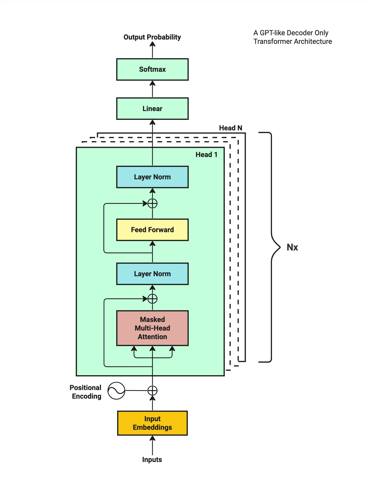

# Transformer 架构教程

## 什么是 Transformer？

Transformer 是一种神经网络架构，最初由 Google 研究人员在 2017 年论文《[Attention is All You Need](https://arxiv.org/abs/1706.03762)》中提出，用于机器翻译。它通过自注意力机制（self-attention）处理序列数据，允许模型关注输入序列的不同部分，从而捕捉长距离依赖关系。与传统 RNN 不同，Transformer 支持并行计算，显著提高效率。

本教程将重点讲解解码器-仅 Transformer（如 GPT），因为它在语言建模任务中广泛应用。我们将通过一个简单句子示例（“我爱深度学习”）逐步展示每个步骤的工作原理，确保初学者能够轻松理解。

## 引言

Transformer 架构自 2017 年提出以来，彻底改变了自然语言处理（NLP）领域。它通过自注意力机制高效捕捉序列中的长距离依赖，取代了传统的 RNN 和 CNN。研究表明，Transformer 的并行计算能力使其在机器翻译、文本生成等任务中表现卓越，成为 GPT、BERT 等模型的核心。

## 高级概览

Transformer 由编码器（Encoder）和解码器（Decoder）组成，每部分包含多个层（通常 6 层），每层有：

- **多头自注意力**：关注序列不同部分，捕捉多种关系。
- **前馈神经网络**：对每个位置独立处理，增加非线性。
- **残差连接和层归一化**：稳定训练，改善梯度流动。

我画了一张图来说明类似 GPT 的仅解码器 Transformer 架构的训练过程：



> 1. 首先，我们需要一个输入字符序列作为训练数据。这些输入被转换成向量嵌入格式。
> 2. 接下来，我们向向量嵌入添加位置编码，以捕获序列中每个字符的位置。
> 3. 随后，模型通过一系列计算操作处理这些输入嵌入，最终为给定的输入文本生成可能的下一个字符的概率分布。
> 4. 该模型根据训练数据集中实际的后续字符评估预测结果，并相应地调整概率或“权重”。
> 5. 最后，模型迭代地完善这一过程，不断更新其参数以提高未来预测的精度。

本教程聚焦解码器-仅 Transformer，适用于语言建模。以下是主要步骤：

> 然而，GPT 模型仅使用 Transformer 架构的解码器部分。

| 步骤                   | 描述                             | 作用                               |
| ---------------------- | -------------------------------- | ---------------------------------- |
| 1. 分词                | 将文本分割为 token 并映射为 ID。 | 将文本转换为模型可处理的数字表示。 |
| 2. 词嵌入              | 将 token ID 转为密集向量。       | 捕捉 token 的语义信息。            |
| 3. 位置编码            | 添加序列位置信息。               | 提供 token 顺序信息。              |
| 4. Transformer 块      | 包含多头自注意力和前馈网络。     | 捕捉序列依赖并处理表示。           |
| 5. 残差连接和层归一化  | 稳定训练。                       | 改善梯度流动和训练稳定性。         |
| 6. 前馈神经网络        | 独立处理每个位置。               | 增加非线性，增强表示能力。         |
| 7. 重复 Transformer 块 | 堆叠多层。                       | 学习复杂模式。                     |
| 8. 输出概率            | 生成下一个 token 的概率。        | 预测输出序列。                     |

## 步骤 1：分词（Tokenization）

### 什么是分词？

分词是将输入文本分解为较小单元（token）的过程，这些单元可以是单词、子词或字符。每个 token 被映射到一个唯一的整数 ID，作为模型的输入。

### 为什么需要分词？

神经网络无法直接处理文本，需要将文本转换为数字表示。分词将文本分解为离散单元，允许模型通过嵌入层将这些单元转换为向量。此外，分词处理未知词汇（OOV），通过子词分词（如 BPE）将未知词分解为常见子词。

### 如何在 Transformer 中实现分词？

Transformer 通常使用子词分词技术，如 Byte Pair Encoding（BPE）或 WordPiece。这些方法通过统计分析构建词汇表，平衡词汇表大小和覆盖率。例如，BPE 从字符开始，逐步合并高频字符对，形成子词。

**示例：**
为了演示，我们后续都使用我将使用包含 460k 个字符的[销售教科书数据集](https://waylandzhang.github.io/en/transformer-architecture.html#step-2-word-embeddings)进行训练。

>1. File size: 450Kb
>2. Vocab size: 3,771 (means unique words/sub-words)

**代码示例：**

```python
import tiktoken


def tokenization_test():
    text = "Chapter 1: Building Rapport and Capturing"
    tokenizer = tiktoken.get_encoding("cl100k_base")
    tokens = tokenizer.encode(text)
    print(tokens)

if __name__ == '__main__':
    tokenization_test()
# 输出结果
# [26072, 220, 16, 25, 17283, 23097, 403, 323, 17013, 1711]
```

*如您所见，数字 220 用来表示空格字符。将字符标记为整数有很多方法。对于我们的示例数据集，我们将使用 tiktoken 库。*

我们的训练数据包含一个词汇表，词汇表中有3,771个不同的字符。我们用于标记教科书数据集的最大数字是100069，它被映射到一个字符“Clar”。

一旦我们有了标记化的映射，我们就可以为数据集中每个字符找到对应的整数索引。

接下来，我们将使用这些分配的整数索引作为标记，而不是在使用模型时使用整个单词。

**可视化：**
参考《[The Illustrated Transformer](https://jalammar.github.io/illustrated-transformer/)》中的分词图，展示文本如何被分割为 token。

**补充说明：**
中文分词因缺乏明显词界而需复杂算法，常用工具如 `jieba`。子词分词在多语言模型中更常见，因其能处理多种语言的未知词汇。

## 步骤 2：词嵌入（Word Embeddings）

### 什么是词嵌入？

词嵌入是将 token ID 转换为密集向量表示的过程。这些向量捕捉 token 的语义信息，作为 Transformer 的输入。

### 为什么需要词嵌入？

词嵌入将离散的 token 转换为连续的向量空间，使模型能够学习词汇之间的语义关系。例如，“猫”和“狗”的嵌入向量可能更接近，而与“桌子”较远。这种表示有助于模型理解上下文和泛化。

### 如何在 Transformer 中实现词嵌入？

通过查找表（Look-Up Table），每个 token ID 对应一个固定维度向量（例如 512 维）。嵌入矩阵的形状为 (词汇表大小, 嵌入维度)，如 (100,000, 512)。

首先，我们构建一个包含词汇表中所有字符的查找表。本质上，该表由一个填充了随机初始化数字的矩阵组成。

假设我们拥有的最大token数量为`100069`，维度为64 *（原文中使用 512 维，记为d_model）*，则得到的查找表为一个*100,069 × 64 的*矩阵，这称为Token Embedding Look-up Table。表示如下：

```
Token Embedding Look-Up Table:
               0         1         2         3         4         5         6         7         8         9   ...        54        55        56        57        58        59        60        61        62        63
0       0.625765  0.025510  0.954514  0.064349 -0.502401 -0.202555 -1.567081 -1.097956  0.235958 -0.239778  ...  0.420812  0.277596  0.778898  1.533269  1.609736 -0.403228 -0.274928  1.473840  0.068826  1.332708
1      -0.497006  0.465756 -0.257259 -1.067259  0.835319 -1.956048 -0.800265 -0.504499 -1.426664  0.905942  ...  0.008287 -0.252325 -0.657626  0.318449 -0.549586 -1.464924 -0.557690 -0.693927 -0.325247  1.243933
2       1.347121  1.690980 -0.124446 -1.682366  1.134614 -0.082384  0.289316  0.835773  0.306655 -0.747233  ...  0.543340 -0.843840 -0.687481  2.138219  0.511412  1.219090  0.097527 -0.978587 -0.432050 -1.493750
3       1.078523 -0.614952 -0.458853  0.567482  0.095883 -1.569957  0.373957 -0.142067 -1.242306 -0.961821  ... -0.882441  0.638720  1.119174 -1.907924 -0.527563  1.080655 -2.215207  0.203201 -1.115814 -1.258691
4       0.814849 -0.064297  1.423653  0.261726 -0.133177  0.211893  1.449790  3.055426 -1.783010 -0.832339  ...  0.665415  0.723436 -1.318454  0.785860 -1.150111  1.313207 -0.334949  0.149743  1.306531 -0.046524
...          ...       ...       ...       ...       ...       ...       ...       ...       ...       ...  ...       ...       ...       ...       ...       ...       ...       ...       ...       ...       ...
100064 -0.898191 -1.906910 -0.906910  1.838532  2.121814 -1.654444  0.082778  0.064536  0.345121  0.262247  ...  0.438956  0.163314  0.491996  1.721039 -0.124316  1.228242  0.368963  1.058280  0.406413 -0.326223
100065  1.354992 -1.203096 -2.184551 -1.745679 -0.005853 -0.860506  1.010784  0.355051 -1.489120 -1.936192  ...  1.354665 -1.338872 -0.263905  0.284906  0.202743 -0.487176 -0.421959  0.490739 -1.056457  2.636806
100066 -0.436116  0.450023 -1.381522  0.625508  0.415576  0.628877 -0.595811 -1.074244 -1.512645 -2.027422  ...  0.436522  0.068974  1.305852  0.005790 -0.583766 -0.797004  0.144952 -0.279772  1.522029 -0.629672
100067  0.147102  0.578953 -0.668165 -0.011443  0.236621  0.348374 -0.706088  1.368070 -1.428709 -0.620189  ...  1.130942 -0.739860 -1.546209 -1.475937 -0.145684 -1.744829  0.637790 -1.064455  1.290440 -1.110520
100068  0.415268 -0.345575  0.441546 -0.579085  1.110969 -1.303691  0.143943 -0.714082 -1.426512  1.646982  ... -2.502535  1.409418  0.159812 -0.911323  0.856282 -0.404213 -0.012741  1.333426  0.372255  0.722526

[100,069 rows x 64 columns]
```

其中每行代表一个字符（由其标记号索引），每列代表一个维度。

目前，你可以将“维度”视为字符的特征或方面。在我们的例子中，我们指定了 64 个维度，这意味着我们能够以 64 种不同的方式理解字符的文本含义，例如将其分类为名词、动词、形容词等等。

假设现在我们有一个context_length为16的示例训练输入，即：

“ `. By mastering the art of identifying underlying motivations and desires, we equip ourselves with`”

现在，我们使用每个标记化字符（或单词）的整数索引来查找嵌入表，从而检索其嵌入向量。最终，我们得到它们各自的输入嵌入：

```
[ 627, 1383, 88861, 279, 1989, 315, 25607, 16940, 65931, 323, 32097, 11, 584, 26458, 13520, 449]
```

在 Transformer 架构中，多个输入序列会同时并行处理，通常称为多个批次。我们将batch_size设置为4。因此，我们将一次处理四个随机选择的句子作为输入。

```
Input Sequence Batch:
       0     1      2      3     4      5      6      7      8      9      10     11     12     13     14     15
0    627  1383  88861    279  1989    315  25607  16940  65931    323  32097     11    584  26458  13520    449
1  15749   311   9615   3619   872   6444      6   3966     11  10742     11    323  32097     13   3296  22815
2  13189   315   1701   5557   304   6763    374  88861   7528  10758   7526     13   4314   7526   2997   2613
3    323  6376   2867  26470  1603  16661    264  49148    627     18     13  81745  48023  75311   7246  66044

[4 rows x 16 columns]
```

*每行代表一个句子；每列是该句子第 0 到第 15 个位置的字符。*

结果，我们现在有一个表示 4 个批次（每个批次 16 个字符）输入的矩阵。该矩阵的形状为(batch_size, context_length) = [4, 16]。

回顾一下，我们之前将输入嵌入查找表定义为一个大小为*100,069 × 64*的矩阵。下一步是将输入序列矩阵映射到这个嵌入矩阵上，以获得我们的输入嵌入。

这里，我们将重点分解输入序列矩阵的每一行，从第一行开始。首先，我们将第一行从其原始尺寸 (1, context_length) = [1, 16] 重塑为新的格式 (context_length, 1) = [16, 1]。随后，我们将重构后的行叠加到之前建立的大小为 (vocab_size, d_model) = [100069, 64] 的嵌入矩阵上，从而用匹配的嵌入向量替换给定上下文窗口内的每个字符。最终的输出是一个形状为(context_length, d_model) = [16, 64] 的矩阵。

输入序列批次的第一行：

```
Input Embedding:
          0         1         2         3         4         5         6         7         8         9   ...        54        55        56        57        58        59        60        61        62        63
0   1.051807 -0.704369 -0.913199 -1.151564  0.582201 -0.898582  0.984299 -0.075260 -0.004821 -0.743642  ...  1.151378  0.119595  0.601200 -0.940352  0.289960  0.579749  0.428623  0.263096 -0.773865 -0.734220
1  -0.293959 -1.278850 -0.050731  0.862562  0.200148 -1.732625  0.374076 -1.128507  0.281203 -1.073113  ... -0.062417 -0.440599  0.800283  0.783043  1.602350 -0.676059 -0.246531  1.005652 -1.018667  0.604092
2  -0.292196  0.109248 -0.131576 -0.700536  0.326451 -1.885801 -0.150834  0.348330 -0.777281  0.986769  ...  0.382480  1.315575 -0.144037  1.280103  1.112829  0.438884 -0.275823 -2.226698  0.108984  0.701881
3   0.427942  0.878749 -0.176951  0.548772  0.226408 -0.070323 -1.865235  1.473364  1.032885  0.696173  ...  1.270187  1.028823 -0.872329 -0.147387 -0.083287  0.142618 -0.375903 -0.101887  0.989520 -0.062560
4  -1.064934 -0.131570  0.514266 -0.759037  0.294044  0.957125  0.976445 -1.477583 -1.376966 -1.171344  ...  0.231112  1.278687  0.254688  0.516287  0.621753  0.219179  1.345463 -0.927867  0.510172  0.656851
5   2.514588 -1.001251  0.391298 -0.845712  0.046932 -0.036732  1.396451  0.934358 -0.876228 -0.024440  ...  0.089804  0.646096 -0.206935  0.187104 -1.288239 -1.068143  0.696718 -0.373597 -0.334495 -0.462218
6   0.498423 -0.349237 -1.061968 -0.093099  1.374657 -0.512061 -1.238927 -1.342982 -1.611635  2.071445  ...  0.025505  0.638072  0.104059 -0.600942 -0.367796 -0.472189  0.843934  0.706170 -1.676522 -0.266379
7   1.684027 -0.651413 -0.768050  0.599159 -0.381595  0.928799  2.188572  1.579998 -0.122685 -1.026440  ... -0.313672  1.276962 -1.142109 -0.145139  1.207923 -0.058557 -0.352806  1.506868 -2.296642  1.378678
8  -0.041210 -0.834533 -1.243622 -0.675754 -1.776586  0.038765 -2.713090  2.423366 -1.711815  0.621387  ... -1.063758  1.525688 -1.762023  0.161098  0.026806  0.462347  0.732975  0.479750  0.942445 -1.050575
9   0.708754  1.058510  0.297560  0.210548  0.460551  1.016141  2.554897  0.254032  0.935956 -0.250423  ... -0.552835  0.084124  0.437348  0.596228  0.512168  0.289721 -0.028321 -0.932675 -0.411235  1.035754
10 -0.584553  1.395676  0.727354  0.641352  0.693481 -2.113973 -0.786199 -0.327758  1.278788 -0.156118  ...  1.204587 -0.131655 -0.595295 -0.433438 -0.863684  3.272247  0.101591  0.619058 -0.982174 -1.174125
11 -0.753828  0.098016 -0.945322  0.708373 -1.493744  0.394732  0.075629 -0.049392 -1.005564  0.356353  ...  2.452891 -0.233571  0.398788 -1.597272 -1.919085 -0.405561 -0.266644  1.237022  1.079494 -2.292414
12 -0.611864  0.006810  1.989711 -0.446170 -0.670108  0.045619 -0.092834  1.226774 -1.407549 -0.096695  ...  1.181310 -0.407162 -0.086341 -0.530628  0.042921  1.369478  0.823999 -0.312957  0.591755  0.516314
13 -0.584553  1.395676  0.727354  0.641352  0.693481 -2.113973 -0.786199 -0.327758  1.278788 -0.156118  ...  1.204587 -0.131655 -0.595295 -0.433438 -0.863684  3.272247  0.101591  0.619058 -0.982174 -1.174125
14 -1.174090  0.096075 -0.749195  0.395859 -0.622460 -1.291126  0.094431  0.680156 -0.480742  0.709318  ...  0.786663  0.237733  1.513797  0.296696  0.069533 -0.236719  1.098030 -0.442940 -0.583177  1.151497
15  0.401740 -0.529587  3.016675 -1.134723 -0.256546 -0.219896  0.637936  2.000511 -0.418684 -0.242720  ... -0.442287 -1.519394 -1.007496 -0.517480  0.307449 -0.316039 -0.880636 -1.424680 -1.901644  1.968463

[16 rows x 64 columns]
```

*矩阵显示映射后的四行之一*

对其余 3 行也执行同样的操作，最后得到 4 组 x [16 行 x 64 列]。

这会导致输入嵌入矩阵的形状为(batch_size, context_length, d_model) = [4, 16, 64]。

本质上，为每个单词提供独特的嵌入可以使模型适应语言的变化并管理具有多种含义或形式的单词。

让我们继续理解，我们的输入嵌入矩阵是我们模型的预期输入格式，即使我们还没有完全掌握其中的数学原理。

**补充说明：**
词嵌入通常通过训练学习，初始为随机值。预训练模型（如 BERT）可能使用上下文嵌入，但解码器-仅 Transformer 使用静态嵌入。

## 步骤 3：位置编码（Positional Encoding）

### 什么是位置编码？

位置编码是为每个 token 添加位置信息的机制，因为 Transformer 没有循环或卷积操作来捕捉 token 顺序。

### 为什么需要位置编码？

自注意力机制是置换不变的，不考虑 token 顺序。例如，没有位置编码，模型无法区分“我爱深度学习”和“学习深度爱我”。位置编码通过为每个位置生成唯一向量，告知模型 token 的相对或绝对位置。

### 如何在 Transformer 中实现位置编码？

使用正弦和余弦函数生成位置编码，公式为：

- ( PE(pos, 2i) = \sin(pos / 10000^{2i / d_{model}}) )
- ( PE(pos, 2i+1) = \cos(pos / 10000^{2i / d_{model}}) )

其中 ( pos ) 是位置，( i ) 是维度索引，( d_{model} ) 是嵌入维度（如 512）。这些函数生成周期性信号，低维度捕捉高频（局部）信息，高维度捕捉低频（全局）信息。

**为什么使用正弦和余弦？**
正弦和余弦函数是周期性的，允许模型学习相对位置关系，且对未见过的序列长度具有泛化能力。它们还确保编码值在 [-1, 1] 范围内，与词嵌入兼容。

**示例：**
对于“我爱深度学习”（4 个 token），位置编码生成形状为 (4, 512) 的矩阵，添加到词嵌入中。假设 ( d_{model} = 4 )，位置 0 和 1 的编码如下：

| 位置 | 维度 0                 | 维度 1                 | 维度 2                    | 维度 3               |
| ---- | ---------------------- | ---------------------- | ------------------------- | -------------------- |
| 0    | sin(0/10000^0) ≈ 0     | cos(0/10000^0) ≈ 1     | sin(0/10000^2/4) ≈ 0      | cos(0/10000^2/4) ≈ 1 |
| 1    | sin(1/10000^0) ≈ 0.841 | cos(1/10000^0) ≈ 0.540 | sin(1/10000^2/4) ≈ 0.0001 | cos(1/10000^2/4) ≈ 1 |

**代码示例：**

```python
import torch
import math

class PositionalEncoding(nn.Module):
    def __init__(self, d_model, max_len=5000):
        super().__init__()
        pe = torch.zeros(max_len, d_model)
        position = torch.arange(0, max_len, dtype=torch.float).unsqueeze(1)
        div_term = torch.exp(torch.arange(0, d_model, 2).float() * (-math.log(10000.0) / d_model))
        pe[:, 0::2] = torch.sin(position * div_term)
        pe[:, 1::2] = torch.cos(position * div_term)
        pe = pe.unsqueeze(0)
        self.register_buffer('pe', pe)

    def forward(self, x):
        return x + self.pe[:, :x.size(1)]
```

**可视化：**
参考《[The Illustrated Transformer](https://jalammar.github.io/illustrated-transformer/)》中的位置编码图，展示正弦和余弦波形如何随位置变化。


到目前为止，我们已经介绍了模型的输入编码和位置编码部分。让我们转到 Transformer 模块。

## 步骤 4：Transformer 块（Transformer Block）

### 什么是 Transformer 块？


Transformer 块是 Transformer 架构的核心，包含多头自注意力和前馈神经网络两个子层，每个子层后接残差连接和层归一化。

### 为什么需要 Transformer 块？

Transformer 块通过自注意力捕捉序列中的依赖关系，通过前馈网络增加非线性，允许模型学习复杂模式。残差连接和层归一化确保深层网络的训练稳定性。

#### 4.1 多头自注意力概览

Transformer 的优势源于一种名为“自注意力”的机制。借助自注意力机制，模型能够密切关注输入中最关键的部分。每个部分被称为“头部”。

头部的工作原理如下：头部通过三个独特的层（分别为查询 (Q)、键 (K) 和值 (V)）来处理输入。它首先比较 Q 和 K，调整结果，然后利用这些比较结果创建一组分数，以显示哪些信息重要。这些分数随后用于权衡 V 中的信息，从而更加关注重要的部分。头部的学习过程源于随着时间的推移，不断调整 Q、K 和 V 层的设置。

多头注意力机制由多个独立的注意力头堆叠而成。所有注意力头接收完全相同的输入，但在计算过程中各自使用特定的权重集。处理输入后，所有注意力头的输出会被连接起来，然后通过一个线性层。

下图直观地展示了头部内的过程以及多头注意力模块的细节。


**什么是自注意力(masked multi-head attention)？**
自注意力是一种机制，允许每个 token 关注序列中的所有其他 token，计算它们之间的相关性。它通过查询（Query）、键（Key）和值（Value）向量实现。

**什么是多头自注意力？**
多头自注意力将自注意力分成多个“头”，每个头关注序列的不同方面（如语法、语义），然后将结果拼接起来。

**为什么使用多头自注意力？**
多头机制增加模型容量，允许同时学习多种关系。例如，一个头可能关注主语-动词关系，另一个关注修饰语。

为了进行注意力计算，我们引入原始论文《Attention is all you need》中的公式：


根据公式，我们首先需要三个矩阵：Q（查询）、K（键）和V（值）。为了计算注意力分数，我们需要执行以下步骤：

1. 将 Q 乘以 K 转置（表示为 K^T）
2. 除以 K 维的平方根
3. 应用softmax函数
4. 乘以 V

我们将逐一进行讨论。

#### 4.2 准备 Q、K、V

通过线性变换从输入嵌入生成 Q、K、V 向量，矩阵形状为 ( (d_{model}, d_{model}) )。

#### 4.3 计算 QK 注意力

计算 Q 和 K 的点积，得到注意力分数。

#### 4.4 缩放

分数除以 (\sqrt{d_k})，防止大值导致 softmax 饱和。

#### 4.5 掩码

在解码器中，使用因果掩码（causal mask）防止模型关注未来 token。例如，对于“我爱深度学习”，生成“学习”时只能看到“我爱深度”。

**代码示例：**

```python
def create_mask(size):
    mask = torch.triu(torch.ones(size, size), diagonal=1).bool()
    return mask
```

#### 4.6 Softmax

将分数通过 softmax 转换为概率分布。

#### 4.7 计算 V 注意力

使用注意力权重加权 V，生成上下文向量。

#### 4.8 拼接和输出

拼接多头输出，通过线性层生成最终注意力输出。

**代码示例：**

```python
class MultiHeadAttention(nn.Module):
    def __init__(self, d_model, num_heads):
        super().__init__()
        self.d_model = d_model
        self.num_heads = num_heads
        self.d_k = d_model // num_heads
        self.q_linear = nn.Linear(d_model, d_model)
        self.k_linear = nn.Linear(d_model, d_model)
        self.v_linear = nn.Linear(d_model, d_model)
        self.out_linear = nn.Linear(d_model, d_model)

    def forward(self, q, k, v, mask=None):
        batch_size = q.size(0)
        q = self.q_linear(q).view(batch_size, -1, self.num_heads, self.d_k).transpose(1, 2)
        k = self.k_linear(k).view(batch_size, -1, self.num_heads, self.d_k).transpose(1, 2)
        v = self.v_linear(v).view(batch_size, -1, self.num_heads, self.d_k).transpose(1, 2)
        scores = torch.matmul(q, k.transpose(-2, -1)) / math.sqrt(self.d_k)
        if mask is not None:
            scores = scores.masked_fill(mask == 0, -1e9)
        attention = torch.softmax(scores, dim=-1)
        context = torch.matmul(attention, v)
        context = context.transpose(1, 2).contiguous().view(batch_size, -1, self.d_model)
        return self.out_linear(context)
```

## 步骤 5：残差连接和层归一化

### 什么是残差连接和层归一化？

残差连接将子层的输入添加到其输出，层归一化对每个位置的特征进行归一化。

### 为什么需要残差连接？

残差连接通过 ( x + \text{sub-layer}(x) ) 允许梯度直接流动，缓解深层网络的梯度消失问题。

### 为什么需要层归一化？

层归一化通过标准化每个位置的特征（均值为 0，方差为 1），减少内部协变量偏移，稳定训练。

**示例：**
对于“我爱深度学习”的嵌入向量，经过多头注意力后，残差连接将输入嵌入与注意力输出相加，然后归一化。

**代码示例：**

```python
class TransformerBlock(nn.Module):
    def __init__(self, d_model, num_heads):
        super().__init__()
        self.mha = MultiHeadAttention(d_model, num_heads)
        self.norm1 = nn.LayerNorm(d_model)
        self.ffn = nn.Sequential(
            nn.Linear(d_model, d_model * 4),
            nn.ReLU(),
            nn.Linear(d_model * 4, d_model)
        )
        self.norm2 = nn.LayerNorm(d_model)
        self.dropout = nn.Dropout(0.1)

    def forward(self, x, mask=None):
        attn_output = self.mha(x, x, x, mask)
        x = self.norm1(x + self.dropout(attn_output))
        ffn_output = self.ffn(x)
        x = self.norm2(x + self.dropout(ffn_output))
        return x
```

## 步骤 6：前馈神经网络

### 什么是前馈神经网络？

前馈神经网络是对每个位置独立应用的全连接网络，通常包含两个线性层和 ReLU 激活。

### 为什么需要前馈神经网络？

它为模型引入非线性，允许学习更复杂的模式。每个位置独立处理，确保计算效率。

**公式：**
[ \text{FFN}(x) = \max(0, x W_1 + b_1) W_2 + b_2 ]

**示例：**
对于“我”的嵌入向量 [0.576, 0.141, 0.141, 0.141]，FFN 可能将其扩展到更高维度（如 2048），应用 ReLU，然后投影回 512 维。

## 步骤 7：重复 Transformer 块

### 为什么需要重复 Transformer 块？

堆叠多个 Transformer 块（如 6 层）增加模型深度，允许学习更复杂的模式。每一层进一步精炼表示。

**示例：**
对于“我爱深度学习”，6 层 Transformer 块依次处理嵌入向量，逐步捕捉更高级的语义关系。

## 步骤 8：输出概率

### 什么是输出概率？

通过线性层将 Transformer 块的输出投影到词汇表大小，然后通过 softmax 生成每个 token 的概率分布。

### 为什么需要输出概率？

输出概率用于预测下一个 token，例如在语言建模中，模型预测“我爱深度学习”后的下一个词。

**示例：**
假设词汇表大小为 10,000，输出为 (4, 10,000) 的概率分布，表示每个 token 的下一个 token 概率。

**代码示例：**

```python
class LanguageModel(nn.Module):
    def __init__(self, vocab_size, d_model, num_heads, num_layers):
        super().__init__()
        self.embedding = nn.Embedding(vocab_size, d_model)
        self.pos_encoder = PositionalEncoding(d_model)
        self.transformer = nn.ModuleList([TransformerBlock(d_model, num_heads) for _ in range(num_layers)])
        self.fc = nn.Linear(d_model, vocab_size)

    def forward(self, x, mask=None):
        x = self.embedding(x)
        x = self.pos_encoder(x)
        for block in self.transformer:
            x = block(x, mask)
        return self.fc(x)
```

## 训练 Transformer

### 训练过程

Transformer 训练通常分为预训练和微调：

- **预训练**：在大型语料库上使用因果语言建模（预测下一个 token）训练模型，学习通用语言表示。
- **微调**：在特定任务（如翻译、问答）上调整模型参数。

**损失函数**：交叉熵损失，比较预测概率与真实 token。

**优化器**：通常使用 Adam 优化器，结合学习率调度（如 warmup）。

**示例：**
对于“我爱深度学习”，模型预测“学习”后的下一个 token，计算预测概率与真实 token 的损失，调整权重。

## 与编码器-解码器 Transformer 的比较

解码器-仅 Transformer（如 GPT）用于生成任务，关注自身输入。编码器-解码器 Transformer（如原始 Transformer）适合翻译：

- **编码器**：处理输入序列，生成表示。
- **解码器**：生成输出序列，关注编码器输出和自身输入。

## 常见问题解答（FAQ）

1. **为什么 Transformer 不使用循环结构？**
   Transformer 通过自注意力并行处理整个序列，避免 RNN 的顺序处理瓶颈，提高效率。
2. **如何处理长距离依赖？**
   自注意力允许每个 token 关注所有其他 token，无论距离远近。
3. **多头注意力的作用是什么？**
   多头机制允许模型同时关注序列的不同方面，如语法和语义。
4. **为什么需要位置编码？**
   自注意力不考虑顺序，位置编码提供 token 位置信息。
5. **Transformer 如何处理长序列？**
   标准 Transformer 的计算复杂度为 ( O(n^2) )，长序列可能导致内存问题。高效变体（如 Longformer）通过稀疏注意力解决。

## 高级话题与未来方向

截至 2025 年，Transformer 技术持续发展：

- **高效 Transformer**：如 [Longformer](https://arxiv.org/abs/2004.05150)，通过稀疏注意力处理长序列。
- **多模态 Transformer**：如 [Vision Transformer](https://arxiv.org/abs/2010.11929)，将图像分块视为 token。
- **稀疏 Transformer**：减少计算量。
- **专家混合 (MoE)**：如 [Switch Transformer](https://arxiv.org/abs/2101.03961)，提升可扩展性。
- **大型语言模型**：如 GPT-3，参数达 1750 亿。

未来研究可能带来更高效或替代架构，但 Transformer 仍是 AI 核心。

## 结论

本教程通过详细解释、代码示例和图示，为初学者提供了 Transformer 架构的全面介绍。通过示例句子“我爱深度学习”，我们展示了每个步骤的作用和必要性。希望您通过本教程对 Transformer 有深入理解，并为进一步学习打下基础。

## 参考文献

- [Attention is All You Need - Transformer Paper](https://arxiv.org/abs/1706.03762)
- [The Illustrated Transformer - Visual Guide](https://jalammar.github.io/illustrated-transformer/)
- [Harvard NLP Transformer Tutorials](https://scholar.harvard.edu/binxuw/classes/machine-learning-scratch/materials/transformers)
- [Longformer: Efficient Transformer for Long Sequences](https://arxiv.org/abs/2004.05150)
- [Vision Transformer: Transformers for Images](https://arxiv.org/abs/2010.11929)
- [Switch Transformer: Scalable Model with MoE](https://arxiv.org/abs/2101.03961)
